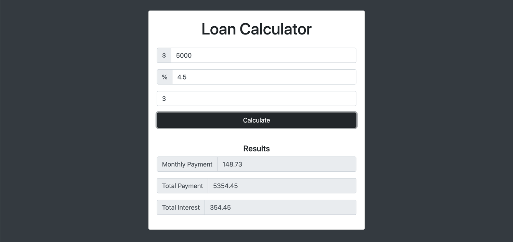

# _Loan Calculator_

#### This project is a browser-based loan calculator application that helps estimate monthly payments, total payment, and total interest on a loan.

#### _06/2021_

#### By _**Chris Korsak**_

## Description

This loan calculator application is a project from [Modern Javascript From The Beginning](https://www.udemy.com/course/modern-javascript-from-the-beginning) on Udemy. It notably incorporates javascript DOM manipulation, timeouts, and an animated gif to provide a better user interface experience during the loan calculation.

Additionally, this application uses a CSS framework called [Bootstrap](https://getbootstrap.com/) to create the user interface. This application is fully responsive to all screen sizes.

### Features
* Add a loan amount, interest rate, and number of years to repay
* A spinning animated-gif displays while the application is calculating the results
* The app will display an error message if the monthly payment amount is not a finite number

## Setup/Installation Requirements

None. This is a web-based application hosted on Github pages. Check out the app [here!](https://chriskorsak.github.io/loan-calculator/)

## Technologies Used

* HTML
* CSS (Bootstrap framework)
* Javascript
  

